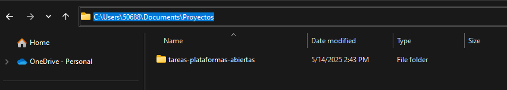
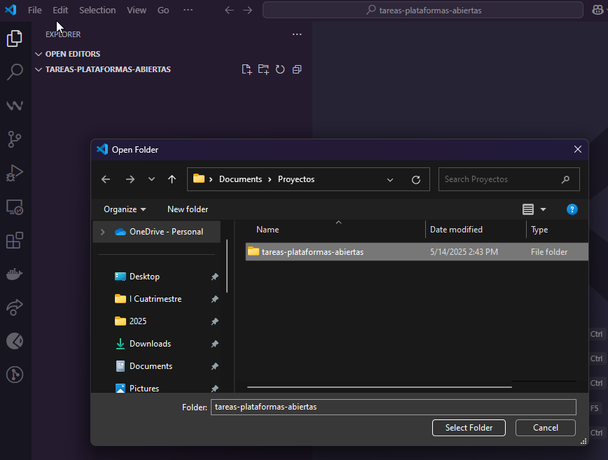
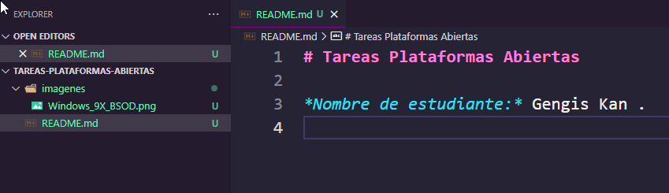
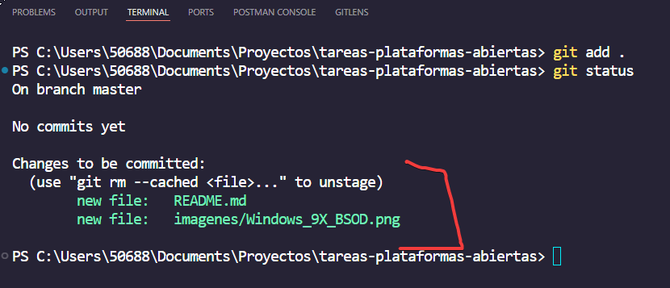
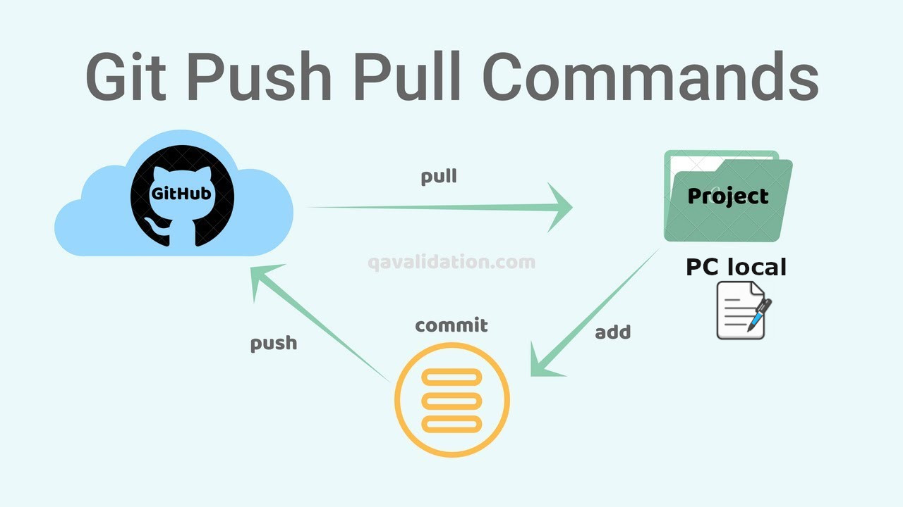

# 🚀 Guía Completa: Crear un Repositorio Git y Subirlo a GitHub

## ✅ Requisitos Previos

1. Tener **Git instalado**  
   👉 [https://git-scm.com/downloads](https://git-scm.com/downloads)

2. Tener una **cuenta de GitHub**  
   👉 [https://github.com](https://github.com)

---

## 🛠️ Paso 1: Configurar Git (solo la primera vez)

Abre una terminal y ejecuta los siguientes comandos:

```bash
git config --global user.name "Tu Nombre"
git config --global user.email "tucorreo@example.com"
```

---

## 📁 Paso 2: Crear un Proyecto Nuevo

1. Crea una carpeta con el nombre de tu proyecto, por ejemplo:  
   `C:\Users\TU-USUARIO\Documents\Proyectos`
2. Abre la carpeta con Visual Studio Code.
3. Una vez abierta, accede a la terminal integrada.





---

## 🔧 Paso 3: Inicializar el Repositorio Git

Inicializa el repositorio local con:

```bash
git init
```

Deberías ver algo como esto:


---

## 📝 Paso 4: Crear un Archivo README y Agregar Imágenes

1. Crea un archivo llamado `README.md` y escribe lo siguiente:

```markdown
# Tareas Plataformas Abiertas

*Nombre de estudiante:* TU NOMBRE Y APELLIDOS.
```

2. Crea una carpeta llamada `imagenes`.
3. Descarga una imagen cualquiera y colócala dentro de la carpeta `imagenes`.  
   También puedes usar esta:  
   👉 

Hasta este momento, el proyecto se debe ver así:  


---

## ➕ Paso 5: Agregar Archivos al Staging

El área de *staging* es donde preparas los archivos antes de confirmarlos (commit).

```bash
git add .
```

Para verificar los archivos agregados, ejecuta:

```bash
git status
```

Deberías ver algo como esto:



---

## 💾 Paso 6: Hacer un Commit

Un *commit* guarda los cambios en tu repositorio local.

```bash
git commit -m "Primer commit"
```


---

## 🌐 Paso 7: Crear un Repositorio en GitHub

1. Ve a [https://github.com](https://github.com)
2. Haz clic en **New**
3. Escribe el nombre del repositorio (ej. `tareas-plataformas-abiertas`)
4. **Desmarca** la opción *Initialize this repository with a README*
5. Haz clic en **Create repository**


---

## 🔗 Paso 8: Conectar el Repositorio Local con GitHub

1. Copia la URL del repositorio recién creado.
2. En tu terminal, ejecuta (reemplaza con tu URL):

```bash
git remote add origin https://github.com/TU-USUARIO/tareas-plataformas-abiertas.git
```

Esto enlaza tu repositorio local con el repositorio remoto en GitHub.


---

## 🚀 Paso 9: Subir tu Proyecto a GitHub

Para subir tu proyecto por primera vez:

```bash
git push -u origin master
```

> ⚠️ Si tu rama principal se llama `main`, usa en su lugar:
>
> ```bash
> git push -u origin main
> ```

---

## 🛠️ Comandos Útiles

Ver estado de los archivos:

```bash
git status
```

Ver historial de commits:

```bash
git log
```

Clonar un repositorio existente:


Por ejemplo, si desea clonar el repositorio de este curso puede hacerlo de la siguiente manera:
```bash
git clone https://github.com/danielcruca/plataformas-abiertas.git
```
Aquí el repo ya existe y entonces solo se hace esto.

# Flujo
