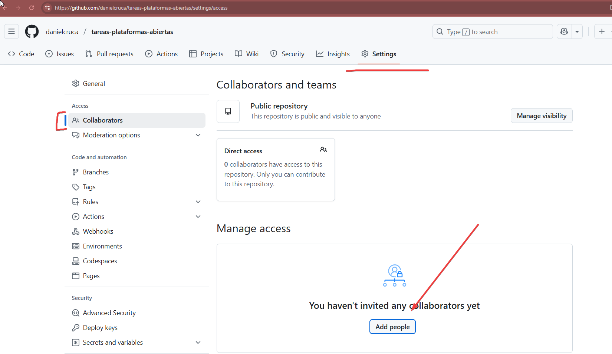

# 🚀 Guía Completa: Crear un repositorio Git y subirlo a GitHub.

## ✅ Requisitos previos

1. Tener **Git instalado**  
   👉 https://git-scm.com/downloads

2. Tener una **cuenta de GitHub**  
   👉 https://github.com/


## ✅ Paso 1: Configurar Git (solo la primera vez)

### Abrir una terminal y ejecutar:
```bash
git config --global user.name "Tu Nombre"
git config --global user.email "tucorreo@example.com"
```

## 📁 Paso 2: Crear un proyecto nuevo

1. Para este paso, crearemos una carpeta con un nombre cualquiera.
2. Puede crearla en cualquier lugar su PC.
3. Por ejemplo: C:\Users\SU-USUARIO\Documents\Proyectos
4. 
5. Abra la carpeta con CODE.
6. 
7. Una vez dentro, abra una terminal.
8. 

## 🧠 Paso 3: Inicializar Git

Para inicializar el repositorio git(o sea el local),ejecute en la terminal lo siguiente:

```bash
git init
```
Debera de ver algo asi:


## ✍️ Paso 4: Crear algún archivo (ejemplo: README)

1. Crear un archivo llamado `README.md` con el siguiente contenido:

```markdown
# Tareas Plataformas Abiertas

*Nombre de estudiante:* SU NOMBRE Y APELLIDOS.

```
2. Crear un folder llamado imagenes.
3. Bajar una imagen cualquiera y agregarla en imagenes. O puede descargar . 
4. Hasta este momento, el proyecto se debe de ver asi.


## ➕ Paso 5: Agregar archivos al staging

*Nota:*El staging o área de preparación antes de hacer el commit.

```bash
git add .
```
Puede ejecutar el siguiente comando para verificar los archivos:

```bash
git status
```
Se deberá de ver algo asi:


## 💾 Paso 6: Hacer un commit

Commit es la acción de guardar los cambios en el repositorio local.

```bash
git commit -m "Primer commit"
```

Hasta este momento tenemos todo listo en el repositorio local

## 🌐 Paso 7: Crear el repositorio en GitHub (Solo cuando se crea un repo nuevo)

1. Ir a [https://github.com](https://github.com)
2. Hacer clic en **New**
3. Ponerle un nombre (ej. `tareas-plataformas-abiertas`)
4. **No** seleccionar la opción de "Initialize with README"
5. Click en **Create repository**


## 🔗 Paso 8: Conectar el repositorio local con el remoto (Solo se hace una vez)

1. Luego de crear el repositorio en GitHub, copia la URL del repositorio.

2.En la terminal ejecuta lo siguiente remplazando la URL con la URL del repositorio que copiaste.

```bash
git remote add origin https://github.com/SU-USUARIO/tareas-plataformas-abiertas.git
```
*Nota:* Aca estamos creando un enlace entre el local y el remoto. Y diciendo que el origin es el remoto.

## 🚀 Paso 9: Subir el proyecto a GitHub(Ejecutar cada vez que se envian cambios al repo)
```bash
git push -u origin master
```

> ⚠️ Si tu rama se llama `main` en lugar de `main`, usá:
> ```bash
> git push -u origin main
> ```

## 🛠️ Comandos Útiles

Ver estado de los archivos:
```bash
git status
```

Ver historial de commits:
```bash
git log
```

Clonar un repositorio existente:

```bash
git clone https://github.com/usuario/repositorio.git
```
